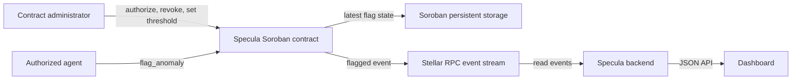

# Specula Soroban Contract

[](https://github.com/Specula-Labs/specula-contracts/actions/workflows/ci.yml)
[](LICENSE)
[](https://developers.stellar.org)
[](https://www.rust-lang.org)
[](CONTRIBUTING.md)

Soroban contract for administrator-managed monitoring agents, a configurable 0–100 score threshold, and account flags. It publishes `flagged` events and stores the latest flag for each subject. It does not store full history; event indexing is needed for that.

## How it uses Stellar

Specula is a Stellar-native monitoring contract rather than a wrapper around an off-chain service:

- **Soroban smart contract** compiled to `wasm32v1-none` and deployed to Stellar Testnet.
- **Account flags on ledger state** — the latest flag per subject is written to Soroban persistent storage, so any client can read it without a database.
- **`flagged` contract events** published for every accepted anomaly and consumed downstream through Stellar RPC (`getEvents`).
- **Stellar account authorization** — administrator and agent authority is enforced with Soroban `require_auth`, so only authorized keys can change configuration or flag an account.
- **Network-aware deployment** — Testnet and Mainnet are separate instances, each built and deployed with its own network passphrase and RPC endpoint.

## Table of Contents

- [How it uses Stellar](#how-it-uses-stellar)
- [Architecture](#architecture)
- [Testnet deployment](#testnet-deployment)
  - [Reproduce a separate Testnet deployment](#reproduce-a-separate-testnet-deployment)
- [Project layout](#project-layout)
- [Prerequisites](#prerequisites)
- [Build and test](#build-and-test)
- [Contract interface](#contract-interface)
- [Environment Variables](#environment-variables)
- [Security Notes](#security-notes)

## Architecture



The backend reads events and does not sign or submit transactions. The contract and backend RPC must use the same network for events to appear in the dashboard.

## Testnet deployment

The current Specula instance is deployed and initialized on the **Stellar Testnet**. It uses the Testnet network passphrase `Test SDF Network ; September 2015` and the Soroban RPC endpoint `https://soroban-testnet.stellar.org`.

| Detail | Value |
| --- | --- |
| Contract ID | [`CCZAAZ3FJ7LKZA7E7A6EKQTU2HCNVI3YUVIHKWHSULGZSWAJFS2D2XVX`](https://stellar.expert/explorer/testnet/contract/CCZAAZ3FJ7LKZA7E7A6EKQTU2HCNVI3YUVIHKWHSULGZSWAJFS2D2XVX) |
| Contract source | [`5b6b5a7`](https://github.com/Specula-Labs/specula-contracts/commit/5b6b5a7df1219242579833d0f46f4f215745eca1) |
| Wasm SHA-256 | `f501250438515ff26e18ebf951cd62de717c711e68d031fb0fad5c9a9b36bd5d` |
| Score threshold | `70` (initialized) |
| Admin account | `GAPNXDMWAMEWHEVMSDXYD5BS2V3P6E4A7OPG6F2MLME5666VSPT5BIHM` |
| Authorized monitoring agents | None yet |

Transaction records:

- Wasm upload: [transaction `3838b8af1eadb429f37e7d4c3d6c8267773b138a967d13b816491090a32e3992`](https://stellar.expert/explorer/testnet/tx/3838b8af1eadb429f37e7d4c3d6c8267773b138a967d13b816491090a32e3992)
- Contract deployment: [transaction `903e26dd3d1740d3833714fa30afaaf6466e0823c40250d842944dded6b8e123`](https://stellar.expert/explorer/testnet/tx/903e26dd3d1740d3833714fa30afaaf6466e0823c40250d842944dded6b8e123)
- Initialization: [transaction `bfd4da30f78d13160f95b6d401983db6f70bbba11273e9374989e5b4d0c19b2d`](https://stellar.expert/explorer/testnet/tx/bfd4da30f78d13160f95b6d401983db6f70bbba11273e9374989e5b4d0c19b2d)

The admin identity alias `stellar-specula-testnet-admin` is stored in the deploying machine's macOS Keychain using Stellar CLI secure storage. Its secret is not in this repository. Preserve the Keychain entry and securely back up the recovery material. The backend's `.env.example` points to this contract. The event feed is connected, but it currently has no flags because no monitoring agent has been authorized.

### Reproduce a separate Testnet deployment

These commands create a **new** identity and contract instance; they do not redeploy or alter the contract above. Install the Stellar CLI, Rust, and the Wasm target first. Keep the generated identity in secure storage and never commit its seed phrase.

```bash
stellar keys generate specula-admin --network testnet --fund --secure-store
stellar contract build --locked
stellar contract deploy \
  --wasm target/wasm32v1-none/release/specula_contract.wasm \
  --source-account specula-admin \
  --network testnet \
  --alias specula_contract
stellar contract invoke \
  --id specula_contract \
  --source-account specula-admin \
  --network testnet -- \
  initialize --admin specula-admin --default-threshold 70
```

To verify this deployment's initialized threshold without submitting a transaction:

```bash
stellar contract invoke \
  --id <CONTRACT_ID> \
  --source-account specula-admin \
  --network testnet --send=no -- \
  get_threshold
```

Set the resulting contract ID as the backend's `CONTRACT_ID`. Keep its Horizon and Soroban RPC endpoints on Testnet as well.

## Project layout

- `src/lib.rs` — contract entry points, storage keys, authorization, threshold checks, event publication, and latest-flag lookup.
- `src/test.rs` — contract behavior tests using Soroban test utilities.
- `Cargo.toml` / `Cargo.lock` — Rust and Soroban SDK dependencies.
- `.github/workflows/ci.yml` — Wasm build, unit tests, and Clippy checks.

## Prerequisites

| Tool | Version / Notes | Install |
| --- | --- | --- |
| **Rust** | stable, with the `wasm32-unknown-unknown` and `wasm32v1-none` targets | https://rustup.rs |
| **Stellar CLI** | latest (`stellar --version`) for optimized wasm builds and deployment | `brew install stellar-cli` or [cargo/docs](https://github.com/stellar/stellar-cli) |
| **Stellar account** | funded on the target network (Testnet via friendbot) | `stellar keys generate <name> --network testnet --fund` |

> A C toolchain/LLVM is required to compile Soroban contracts. On macOS install the Xcode Command Line Tools (`xcode-select --install`).

Verify your setup:

```bash
rustup target add wasm32-unknown-unknown wasm32v1-none
rustc --version
stellar --version
```

## Build and test

Requires stable Rust, the `wasm32-unknown-unknown` and `wasm32v1-none` targets, and Stellar CLI for optimized deployment builds. There are no contract-specific environment variables; network IDs and signing identities are supplied to deployment tooling outside this repository.

```bash
rustup target add wasm32-unknown-unknown wasm32v1-none
cargo build --target wasm32-unknown-unknown --release
stellar contract build --locked
cargo test
cargo clippy --all-targets -- -D warnings
```

The CI Wasm artifact is under `target/wasm32-unknown-unknown/release/`. `stellar contract build --locked` creates the optimized deployable artifact under `target/wasm32v1-none/release/`. CI runs the Wasm build, tests, and lint checks (Clippy).

## Contract interface

- `initialize(admin, default_threshold)` — one-time admin and threshold setup.
- `authorize_agent(admin, agent)` / `revoke_agent(admin, agent)` — manage flagging agents.
- `set_threshold(admin, threshold)` / `get_threshold()` — configure/read the threshold. `get_threshold()` panics with `not initialized` until setup is complete; a configured threshold of `0` remains a valid value.
- `is_agent(agent)` — check agent authorization.
- `flag_anomaly(agent, subject, score)` — require an authorized agent and a score at or above threshold; persist the latest record and publish `flagged`.
- `get_latest_flag(subject)` — read the latest record, if one exists.

Only trusted addresses should receive agent authorization. The contract enforces the score range and threshold, but it cannot establish that an off-chain score is accurate. Storage follows Soroban TTL and archival rules. Deploy, initialize, and configure each network separately; never commit secrets.

## Environment Variables

The contract reads no environment variables of its own. Network IDs, signing identities, and RPC endpoints are supplied to the Stellar CLI at build and deploy time (see [Testnet deployment](#testnet-deployment)). Runtime configuration lives with the consumers of this contract, for example `CONTRACT_ID`, `HORIZON_URL`, and `SOROBAN_RPC_URL` in the [specula-api](https://github.com/Specula-Labs/specula-api) backend.

## Security Notes

- **Authorization is on-chain.** Only the configured administrator can change the threshold or manage agents, and only authorized agents can call `flag_anomaly`; both are enforced by Soroban `require_auth`, not by the caller's client.
- **Scores are unverified signals.** The contract enforces the 0–100 range and the threshold, but it cannot establish that an off-chain score is accurate. Treat flags as one input, never as proof of fraud or as compliance advice.
- **Only the latest flag is stored.** Full history exists only in contract events; index them if you need an audit trail, and note that RPC event history is provider-limited.
- **Secrets never enter the repository.** Deploying identities live in Stellar CLI secure storage (for example the macOS Keychain). Never commit seed phrases or secret keys.
- **Each network is independent.** Deploy, initialize, and configure Testnet and Mainnet separately; a threshold or agent set on one does not apply to the other.
